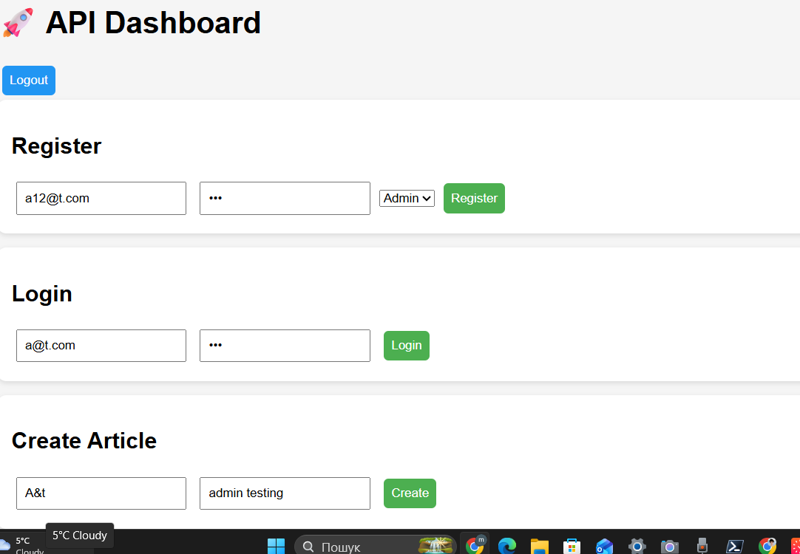
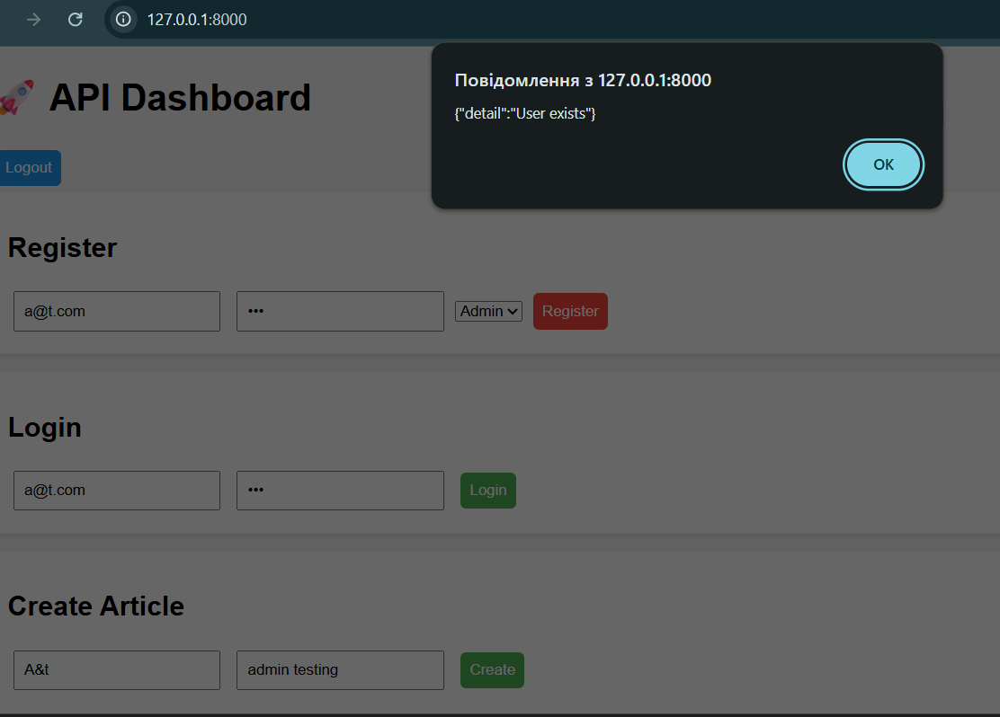
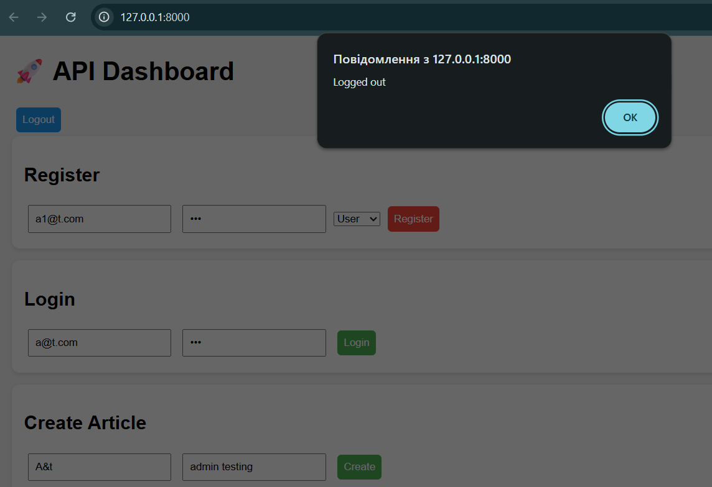
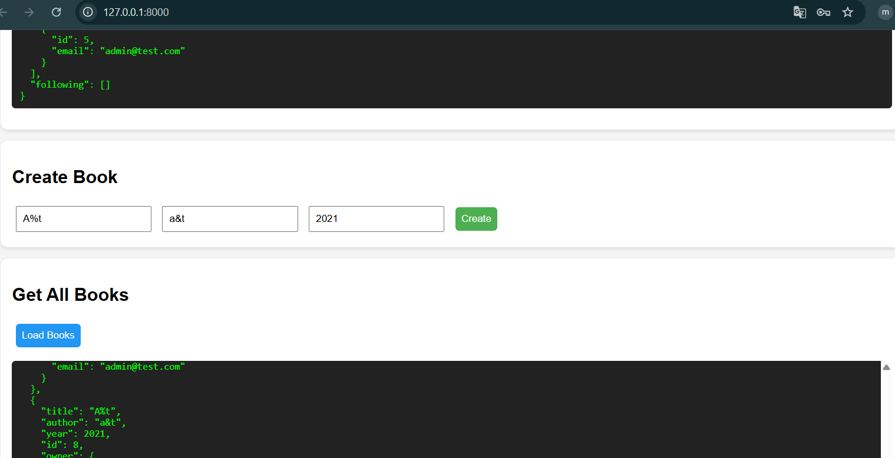
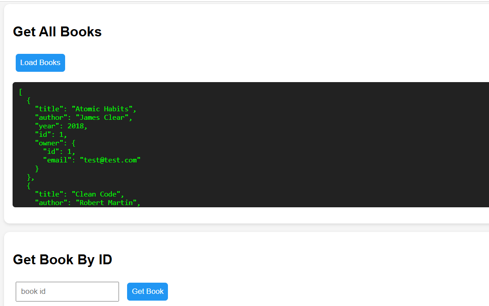
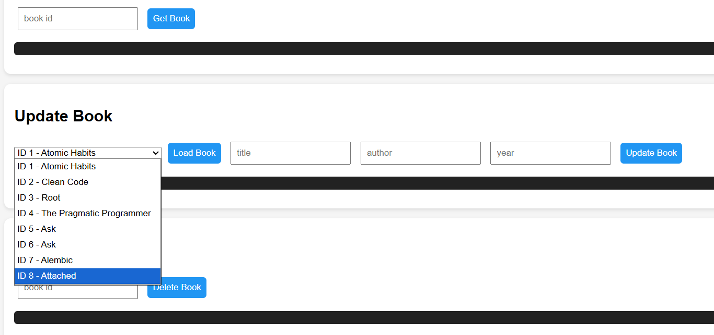
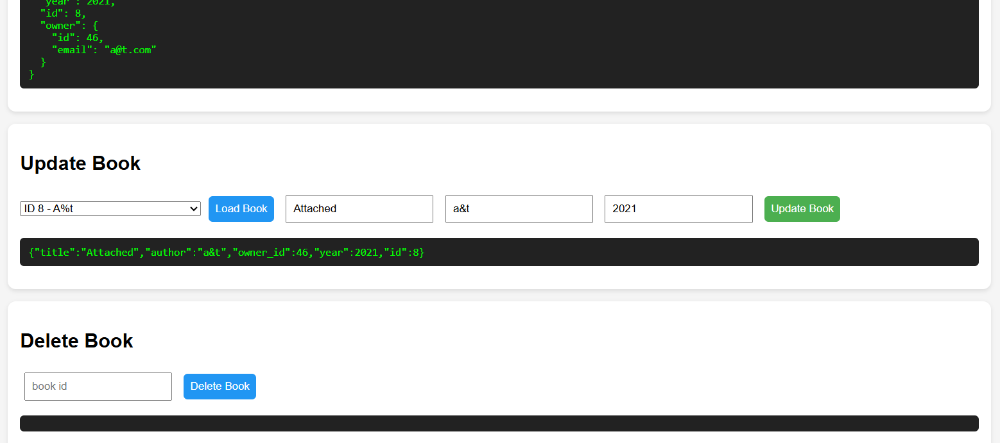
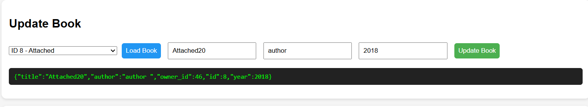
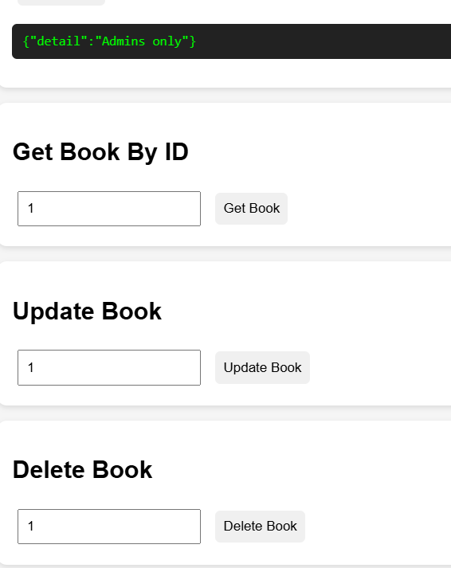
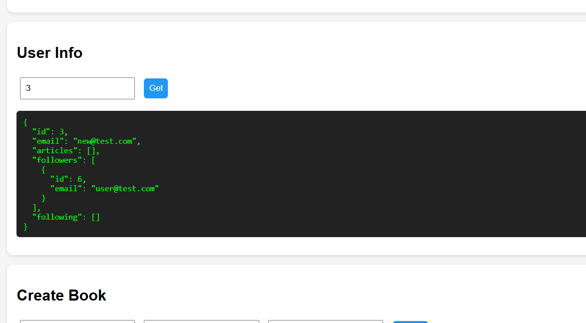

# FastAPI Books & Articles API

Невеликий backend-проєкт на **FastAPI** з JWT-автентифікацією, ролями користувачів, CRUD для книг, роботою зі статтями та базовою соціальною взаємодією між користувачами через підписки.

Проєкт демонструє:

- реєстрацію та логін користувачів;
- `access` і `refresh` токени;
- розмежування прав доступу (`user` / `admin`);
- CRUD-операції для книг;
- створення та перегляд статей;
- підписки на інших користувачів;
- міграції через Alembic;
- автотести через `pytest`;
- CI-перевірку через GitHub Actions.

## Можливості

### Автентифікація

- `POST /register` - реєстрація користувача
- `POST /login` - авторизація та отримання JWT
- `GET /me` - дані поточного користувача
- `POST /refresh` - оновлення access token

### Книги

- `GET /books/` - отримати список книг
- `GET /books/{book_id}` - отримати одну книгу
- `POST /books/` - створити книгу, лише `admin`
- `PUT /books/{book_id}` - оновити книгу, лише `admin`
- `DELETE /books/{book_id}` - видалити книгу, лише `admin`

### Статті та підписки

- `POST /articles/` - створити статтю
- `GET /articles/` - список усіх статей
- `GET /articles/{article_id}` - отримати статтю
- `GET /articles/user/{user_id}` - статті конкретного користувача
- `POST /articles/follow/{user_id}` - підписатися на користувача
- `GET /articles/followers/{user_id}` - список підписників
- `GET /articles/following/{user_id}` - список підписок
- `GET /articles/user-full/{user_id}` - повний профіль користувача

## Технології

- Python 3.11+
- FastAPI
- SQLAlchemy
- SQLite
- Alembic
- Pydantic Settings
- JWT (`python-jose`)
- Passlib / bcrypt
- Pytest
- GitHub Actions

## Структура проєкту

```text
FastApi_1/
├── app/
│   ├── auth/
│   │   ├── jwt.py
│   │   ├── routes.py
│   │   └── schemas.py
│   ├── articles.py
│   ├── books.py
│   ├── database.py
│   ├── dependencies.py
│   ├── frontend.html
│   ├── main.py
│   ├── models.py
│   └── settings.py
├── alembic/
├── tests/
├── .env.dev
├── .env.test
├── alembic.ini
└── requirements.txt
```

## Встановлення та запуск

### 1. Клонування репозиторію

```bash
git clone git@github.com:Marina4e/FastApi_Pet_project.git
cd FastApi_1
```

### 2. Створення віртуального середовища

```bash
python -m venv .venv
```

Windows:

```bash
.venv\Scripts\activate
```

macOS / Linux:

```bash
source .venv/bin/activate
```

### 3. Встановлення залежностей

```bash
pip install -r requirements.txt
```

### 4. Налаштування змінних середовища

Проєкт використовує файл середовища залежно від значення змінної `ENV`:

- `ENV=dev` -> `.env.dev`
- `ENV=test` -> `.env.test`

Мінімальний набір змінних:

```env
DATABASE_URL=sqlite:///./app.db
SECRET_KEY=your_secret_key
ALGORITHM=HS256
ACCESS_TOKEN_EXPIRE_MINUTES=30
```

Для локального запуску в PowerShell:

```powershell
$env:ENV="dev"
```

### 5. Запуск міграцій

```bash
alembic upgrade head
```

### 6. Запуск застосунку

```bash
uvicorn app.main:app --reload
```

Після запуску застосунок буде доступний за адресою:

- API: [http://127.0.0.1:8000](http://127.0.0.1:8000)
- Swagger UI: [http://127.0.0.1:8000/docs](http://127.0.0.1:8000/docs)
- ReDoc: [http://127.0.0.1:8000/redoc](http://127.0.0.1:8000/redoc)

Головна сторінка `/` повертає локальний файл `app/frontend.html`.

## Тестування

Для запуску тестів:

```bash
pytest -v
```

Для тестового середовища використовується окремий файл `.env.test` і база `test.db`.

## Міграції

Основні команди Alembic:

```bash
alembic revision --autogenerate -m "describe changes"
alembic upgrade head
alembic downgrade -1
```

## Приклад ролей доступу

- `user` може переглядати книги та працювати зі статтями
- `admin` може створювати, редагувати й видаляти книги

## CI

У проєкті налаштовано GitHub Actions workflow, який:

- перевіряє стиль коду через `flake8`, `black`, `isort`;
- запускає тести через `pytest`.

## Фото / скріншоти

### 1. Головний вигляд API Dashboard

Головна сторінка застосунку з формами для реєстрації, входу та створення статті. Цей екран показує базовий інтерфейс для взаємодії з API через браузер.
The main application page with forms for registration, login, and article creation. This screen shows the basic interface for interacting with the API through the browser.



### 2. Повідомлення про вже існуючого користувача
Система коректно обробляє повторну реєстрацію та повертає повідомлення про помилку `User exists`, якщо користувач з таким email уже є в базі.
The system correctly handles duplicate registration attempts and returns the `User exists` error message when a user with the same email is already stored in the database.



### 3. Повідомлення про успішний вихід з акаунта

Після натискання кнопки виходу користувач отримує підтвердження `Logged out`, що показує завершення поточної сесії.
After clicking the logout button, the user receives the `Logged out` confirmation, which indicates that the current session has been ended.



### 4. Створення книги та відображення загального списку

Інтерфейс демонструє форму створення книги та блок отримання всіх книг, де повертається JSON-відповідь із записами та інформацією про власника.
The interface demonstrates the book creation form and the section for fetching all books, where a JSON response with records and owner information is returned.



### 5. Список усіх книг у системі

Приклад відповіді для запиту `Get All Books`, де видно кілька книг із назвами, авторами, роком видання та даними власника запису.
An example response for the `Get All Books` request, showing multiple books with titles, authors, publication years, and owner details.



### 6. Вибір книги для редагування зі списку

Випадаючий список у формі оновлення книги дозволяє швидко вибрати потрібний запис за ID та назвою перед редагуванням.
The dropdown list in the book update form allows the user to quickly select the needed record by ID and title before editing.



### 7. Завантаження книги у форму редагування

Після вибору книги дані підтягуються у форму редагування, що дає змогу змінити назву, автора або рік видання перед оновленням.
After selecting a book, its data is loaded into the edit form, making it possible to change the title, author, or publication year before updating.



### 8. Результат успішного оновлення книги

Після оновлення API повертає актуальний JSON-об'єкт книги з новими значеннями, що підтверджує успішне збереження змін.
After the update, the API returns the current JSON object of the book with new values, confirming that the changes were saved successfully.



### 9. Обмеження доступу до адміністративних дій

При спробі виконати адміністративну дію без потрібної ролі інтерфейс показує відповідь `Admins only`, що підтверджує роботу role-based access control.
 When trying to perform an administrative action without the required role, the interface shows the `Admins only` response, confirming that role-based access control is working.



### 10. Отримання повної інформації про користувача

Екран `User Info` показує повний профіль користувача, включно з email, статтями, підписниками та підписками, що демонструє зв'язки між сутностями.
The `User Info` screen displays the full user profile, including email, articles, followers, and following, demonstrating the relationships between entities.



## Автор Marina Cherkashchenko

Проєкт створений як навчальний / pet-проєкт для практики роботи з FastAPI,
автентифікацією, ролями доступу, ORM, міграціями та тестуванням.
